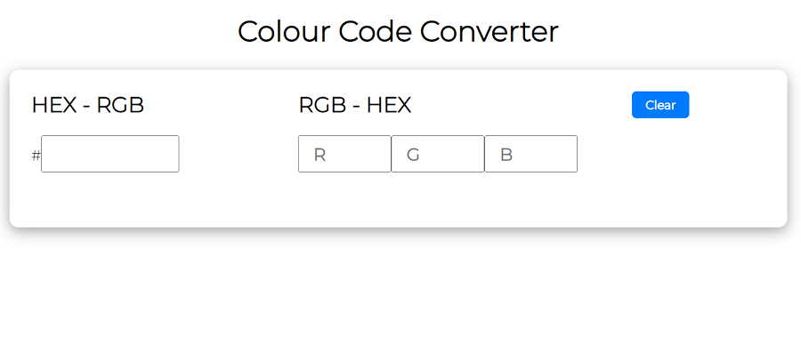
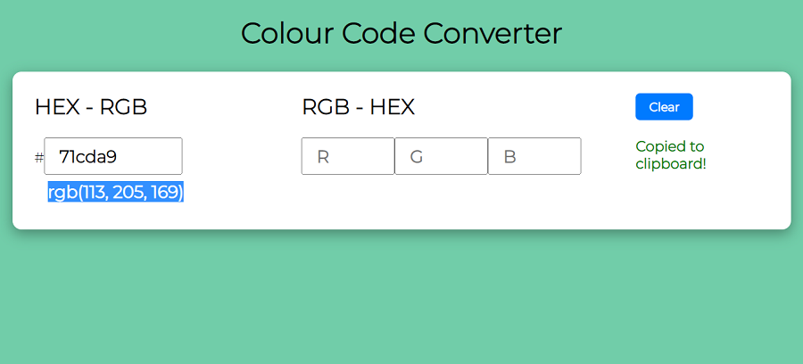
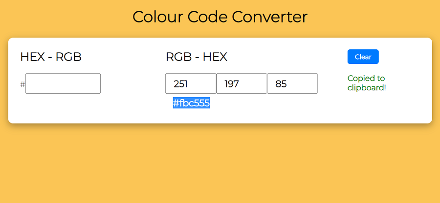
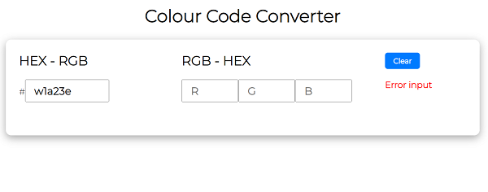
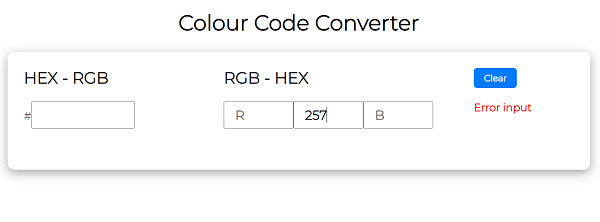

# Colour Code Converter HEX-RGB | RGB-HEX
@author - Pankaj Saha | July 2022 (last update)

This tool is a free online color converter between two color formats RGB and HEX. The tool is fast and very simple to use.

## Live Demo
[Colour Code Conveter HEX-RGB | RGB-HEX](https://piuli.iblogger.org/hexrgb/)

### Screens

> HEX-RGB | RGB-HEX

> HEX-RGB Conversion

> RGB-HEX Conversion

> HEX Conversion Error

> RGB Conversion Error

## Knowledge of converter

> RGB to HEX

It takes input in the form of values for Red, Green and Blue ranging from 0 to 255 and then converts those values to a hexadecimal string that can be used to specify color in html/css code. Photo editing software usually represents color in RGB and therefore if you would like to use the colors you use in your photo editing software as the background of your html element then you will have to get the hexadecimal representation of the RGB values.

> HEX to RGB

A hex triplet is a six-digit, three-byte hexadecimal number used in HTML, CSS, SVG, and other computing applications to represent colors. The bytes represent the red, green and blue components of the color. One byte represents a number in the range 00 to FF (in hexadecimal notation), or 0 to 255 in decimal notation.

## How to convert RGB to HEX
1. Divide rgb color values into red (rr), green (gg), blue (bb) three parts
2. Convert the three parts to hexadecimal
3. Merge the three parts

### Convert red color (46,139,87) to hex color code:

- R = 4610 = 2E16
- G = 13910 = 8B16
- G = 8710 = 5716

Therefore, rgb(46,139,87) = #2E8B57 hex

## How to convert HEX to RGB
1. Divide the hexadecimal color into three parts, the first two digits(R), the middle two digits(G), and the last two character digits(B). 
2. Separate hexadecimal numbers into decimal numbers.

### Convert red color #0063DC to hex color code:
**Hex = 0063DC**

- R = 0016 = 0010
- G = 6316 = 9910
- B = DC16 = 22010

Therefore, #0063DC hex = rgb(0, 99, 220)

